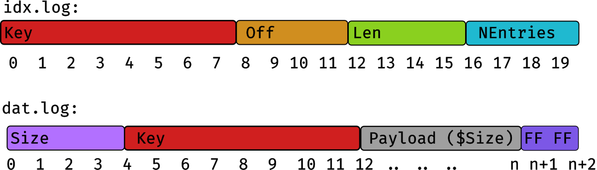

# ``timeq``

[](https://godoc.org/github.com/sahib/timeq)


A persistent priority queue in Go.

> [!WARNING]
> This is still in active development. Before version 1.0 the API and the format on disk might change.

## Features

- Clean and well test code base based on Go 1.21.
- High throughput thanks to batch processing.
- Tiny memory footprint that does not depend on the number of items in the queue.
- Simple interface with classic `Push()` and `Pop()` and only few other functions.
- Configurable durability behavior.

This implementation should be generally useful, despite the ``time`` in the name.
However, the initial design had timestamps as priority keys in mind. For best
performance the following assumptions were made:

- Your OS supports `mmap()` and `mremap()` (i.e. Linux/FreeBSD)
- Seeking in files during reading is cheap (i.e. no HDD)
- The priority key ideally increases without much duplicates (like timestamps, see [FAQ](#FAQ)).
- You push and pop your data in, ideally, big batches.
- File storage is not a primary concern (i.e. no compression implemented).
- The underlying storage has a low risk for write errors or bit flips.
- You trust your data to some random dude's code on the internet (don't we all?).

If some of those assumptions do not fit your use case and you still managed to make it work,
I would be happy for some feedback or even pull requests to improve the general usability.

## Usecase

My primary usecase was a embedded linux device that has different services that generate
a stream of data that needs to be send to the cloud. For this the data was required to be
in ascending order (sorted by time) and also needed to be buffered with tight memory boundaries.

A previous attempt with ``sqlite3`` did work kinda well but was much slower
than it had to be (also due to the heavy cost of ``cgo``). This motivated me to
write this queue implementation.

## Usage

To download the library, just do this in your project:

```bash
$ go get github.com/sahib/timeq@latest
```

We also ship a very minimal command-line client that can be used for experiments.
You can install it like this:

```bash
$ go install github.com/sahib/timeq/cmd@latest
```

## Benchmarks

The [included benchmark](https://github.com/sahib/timeq/blob/main/bench_test.go#L15) pushes 2000 items with a payload of 40 byte per operation.

```
$ make bench
goos: linux
goarch: amd64
pkg: github.com/sahib/timeq
cpu: 12th Gen Intel(R) Core(TM) i7-1270P
BenchmarkPopSyncNone-16      	  35924	    33738 ns/op	    240 B/op	      5 allocs/op
BenchmarkPopSyncData-16      	  35286	    33938 ns/op	    240 B/op	      5 allocs/op
BenchmarkPopSyncIndex-16     	  34030	    34003 ns/op	    240 B/op	      5 allocs/op
BenchmarkPopSyncFull-16      	  35170	    33592 ns/op	    240 B/op	      5 allocs/op
BenchmarkPushSyncNone-16     	  20336	    56867 ns/op	     72 B/op	      2 allocs/op
BenchmarkPushSyncData-16     	  20630	    58613 ns/op	     72 B/op	      2 allocs/op
BenchmarkPushSyncIndex-16    	  20684	    58782 ns/op	     72 B/op	      2 allocs/op
BenchmarkPushSyncFull-16     	  19994	    59491 ns/op	     72 B/op	      2 allocs/op
```

## Design

* All data is divided into buckets by a user-defined function (»`BucketFunc`«).
* Each bucket is it's own priority queue, responsible for a part of the key space.
* A push to a bucket writes the batch of data to a memory-mapped log
  file on disk. The location of the batch is stored in an
  in-memory index and to a index WAL.
* On pop we select the bucket with the lowest key first and ask the index to give
  us the location of the lowest batch. Once done the index is updated to mark the
  items as popped. The data stays intact in the data log.
* Once a bucket was completely drained it is removed from disk to retain space.

Since the index is quite small (only one entry per batch) we can easily fit it in memory.
On the initial load all bucket indexes are loaded, but no memory is mapped yet.

### Limits

* Each item payload might be at most 64M.
* Each bucket can be at most 2^63 bytes in size.
* Using priority keys close to the integer limits is most certainly a bad idea.

### Data Layout

The data is stored on disk in two files per bucket:

* ``data.log``: Stores a single entry of a batch.
* ``idx.log``: Stores the key and location of batches. Can be regenerated from ``dat.log``.

This graphic shows one entry of each:



Each bucket lives in its own directory called `K<key>`.
Example: If you have two buckets, your data looks like this on this:

```
/path/to/db/
├── K00000000000000000001
│   ├── dat.log
│   └── idx.log
└── K00000000000000000002
    ├── dat.log
    └── idx.log
```


NOTE: Buckets get only cleaned up on re-open. Both ``idx.log`` and ``dat.log``
are append-only, so old entries simply get marked as deleted. Since the content
is memory mapped, it's a safety mechanism not to clean up keys directly after
`Push` or `Pop`since this might kill the mapped memory.

### Applied Optimizations

* Data is pushed and popped as big batches and the index only stores batches,
  greatly lowering the usage of memory.
* The API is very friendly towards re-using memory with the `dst` parameter.
* Almost no allocations made during normal operation.
* Data is sliced directly out of the `mmap`, avoiding unnecessary allocation and copying.
  (This comes with the price of letting the caller decide if he needs to copy though).
* Division into small, manageable buckets. Only the buckets that are accessed are actually loaded.
  This allows the use of 32-bit offsets in buckets to save a bit space.
* Both `dat.log` and `idx.log` are append-only, requiring no random seeking.
* ``dat.log`` is memory mapped and resized using `mremap()` in big batches.
  The bigger the log, the bigger the pre-allocation.
* Sorting into buckets during `Push()` uses binary search for fast sorting.
* `Shovel()` can move whole bucket directories, if possible.
* In general, machine empathy was applied to some extent to make the code cache friendly.

## FAQ:

### Can timeq be also used with non-time based keys?

There are no notable places where the key of an item is actually assumed to be
timestamp, except for the default bucket func (which can be configured). If you
find a good way to sort your data into buckets you should be good to go. Keep
in mind that timestamps were the idea behind the original design, so your
mileage may vary - always benchmark your individual usecase. You can modify one
of the existing benchmarks to test your assumptions.

### Why should I care about buckets?

Most importantly: Only buckets are loaded which are being in use.
This allows a very small footprint, especially if the push input is already roughly sorted.

There are also some other reasons:

* If one bucket becomes corrupt for some reason, you loose only the data in this bucket.
* On ``Shovel()`` we can cheaply move buckets if they do not exist in the destination.

### How do I choose the right size of my buckets?

It depends on a few things:

- How much memory do you have at hand?
- In the worst case, how many items would you push to a single bucket?
- How big is each item?
- How many buckets should be open at the same time?

As `timeq` uses `mmap(2)` internally, only the pages that were accessed are
actually mapped to physical memory. However when pushing a lot of data this is
mapped to physical memory as all accessed pages of a bucket stay open (which is
good if you Pop immediately after). So you should be fine if this evaluates to true:

`BytesPerItem * ItemsPerBucketInWorstCase * MaxOpenParallelBuckets < BytesMemoryAvailable - WiggleRoom`.

You can lower the number of open buckets with `MaxOpenParallelBuckets`.

Keep in mind that `timeq` is fast and can be memory-efficient if used correctly,
but it's not a magic device. In future I might introduce a feature that does not
keep the full bucket mapped if it's only being pushed to. The return-on-invest
for such an optimization would be rather small though.

### Can I store more than one value per key?

Yes, no problem. The index may store more than one batch per key. There is a
slight allocation overhead on ``Queue.Push()`` though. Since ``timeq``
was mostly optimized for mostly-unique keys (i.e. timestamps) you might see
better performance with less duplicates.

If you want to use priority keys that are in a very narrow range (thus many
duplicates) then you can think about spreading the range a bit wider.

For example: You have priority keys from zero to ten for the tasks in your job
queue. Instead of using zero to ten as keys, you can add the job-id to the key
and shift the priority: ``(prio << 32) | jobID``.

### How failsafe is ``timeq``?

Time will tell. I intend to use it on a big fleet of embedded devices in the
field. Design wise, damaged index files can be regenerated from the data log.
There's no error correction code applied in the data log and no checksums are
currently written. If you need this, I'm happy if a PR comes in that enables it
as option.

For durability, the design is build to survive crashes without data loss (Push,
Pop) but, in some cases, with duplicated data (Shovel). This assumes a filesystem
with full journaling (``data=journal`` for ext4) or some other filesystem that gives
your similar guarantees. At this point, this was not really tested in the wild yet.
My recommendation is designing your application logic in a way that allows duplicate
items to be handled gracefully.

The test suite is currently roughly as big as the codebase. The best protection
against bugs is a small code base though, so that's not too impressive yet.
We're working on improving the testsuite (which is a never ending task). The
actual coverage is higher than what is shown in `make test` since most
higher-level tests also test lower-level functionality. Additionally we have a
bunch of benchmarks and fuzzing tests.

### Is `timeq` safely usable from several go-routines?

Yes. There is no real speed benefit from doing so though currently.

## License

Source code is available under the MIT [License](/LICENSE).

## Contact

Chris Pahl [@sahib](https://github.com/sahib)

## TODO List

Those need to be resolved before tagging a version 1.0.

- [x] Add fuzzing test for Push/Pop
- [x] Use a configurable logger for warnings
- [x] We crash currently when running out of space.
- [x] Figure out error handling. If a bucket is unreadable, fail or continue?
- [x] Improve docs on why exactly timeq is fast.
- [x] Document thread safety rules
- [ ] Improve test coverage / extend test suite / test for race conditions
- [ ] Profile and optimize a bit more, if possible.

- [ ] Check for integer overflows.
- [ ] Make use of rename.io where appropiate (?)
- [ ] Improve README - add forking idea.
- [ ] Make shovel a method and make it play nice with consumers.

